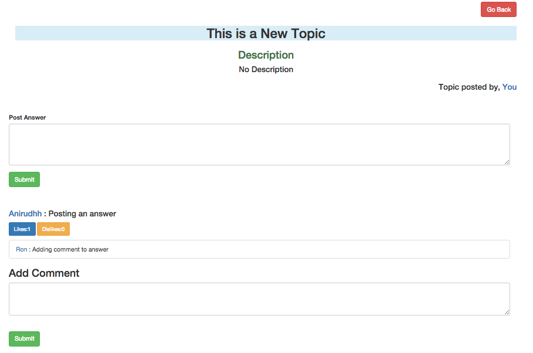

A Simple discussion board like <strong>Stack Overflow</strong> where user can register & login, post topics of interests, or answer existing topics & also comment on existing answer. Option to Like or dislike answers as well.

Requirement to Run on LocalHost

Clone Repo or Download and Unzip
Install Node if required https://nodejs.org/en/
Open folder on Terminal
Enter command "Node server.js"
Open http://localhost:8007/ on browser window. 

